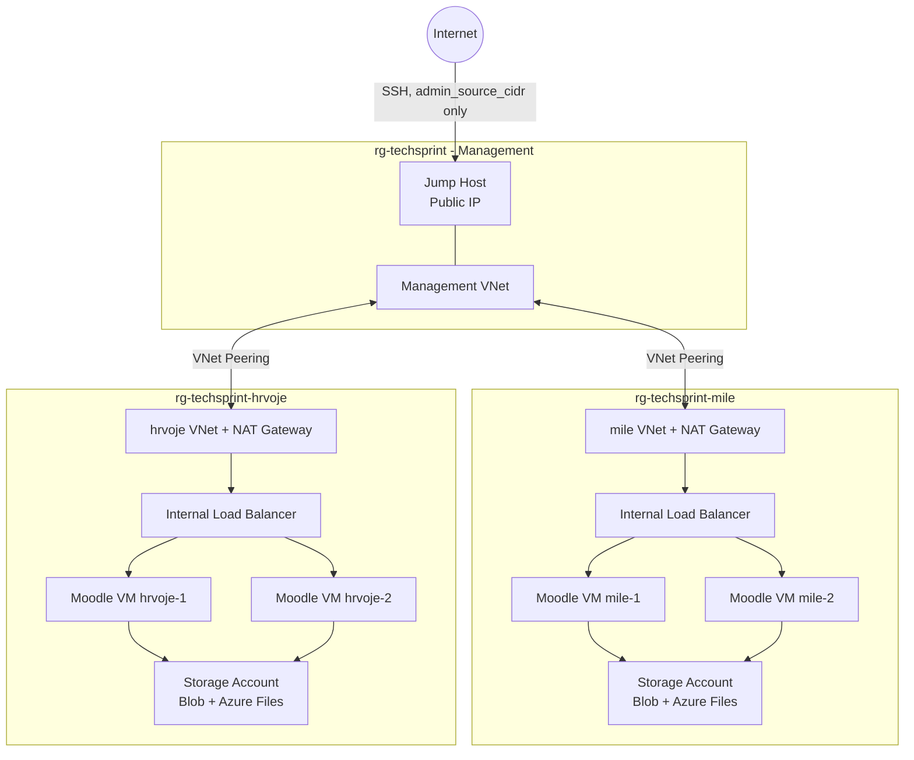

# Azure Environment Design

## Overview

The Azure implementation deploys an isolated Moodle environment for every developer in `data/users.csv`. Each developer receives: a dedicated Resource Group, VNet and subnet; two Moodle VMs (Rocky Linux) behind an internal Load Balancer; a NAT Gateway for outbound Internet access; an NSG and ASG; a managed OS + data disk per VM; and a Storage Account (Blob + Files). A central management environment holds the Jump Host.



## Network isolation and egress

Each developer gets a separate VNet with no direct peering to any other developer VNet — environments are isolated from each other. The management VNet peers individually with every developer VNet, so the Jump Host can reach private developer VMs without exposing them to the Internet.

Only the Jump Host has a public IP, and its SSH NSG rule is restricted to `var.admin_source_cidr` (Terraform refuses `0.0.0.0/0`). The HTTP/HTTPS NSG rules protecting the Moodle ASGs are scoped to the developer's own VNet CIDR, not `*`.

Each developer VNet has its own NAT Gateway for outbound Internet access (package downloads etc.), replacing Azure's deprecated implicit "default outbound access" — without needing a public IP on any application VM.

## Operating system

All VMs run **Rocky Linux** (Azure Marketplace, publisher `erockyenterprisesoftwarefoundationinc1653071250513`), per the task's OS requirement. Because that listing is plan-based, `azure/full/marketplace.tf` accepts the marketplace terms once via `azurerm_marketplace_agreement` before any VM can use it.

## Compute and high availability

`Standard_B2s` (2 vCPU / 4 GB RAM) for all five VMs (4 Moodle + 1 Jump Host). Two Moodle instances per developer (e.g. `vm-mile-moodle-1/2`) sit in the backend pool of that developer's internal Standard Load Balancer, which HTTP-health-checks `/moodle-health.html` and only routes to healthy instances — simulated application-level HA for the course environment.

An Internal Standard Load Balancer was chosen over Application Gateway because the environment doesn't need Layer-7 features (WAF, TLS termination, host/URL routing) — see `docs/azure-lb-vs-app-gateway.md` for the full comparison.

## Storage

Each developer's Storage Account has a Blob container (`moodle-backups`) and an Azure Files share (`moodle-shared`), both accessed via the VM's System Assigned Managed Identity + Azure RBAC (Storage Blob Data Contributor, Storage File Data SMB MI Admin) instead of embedded account keys — Azure Files SMB OAuth is enabled through the AzAPI provider. BlobFuse2 exposes the Blob container as a filesystem. Each Moodle VM also has its own 10 GB managed data disk (Standard LRS — a testing environment doesn't need Premium SSD or geo-redundancy).

## Security summary

NSGs and ASGs restrict network access (see above); Azure RBAC restricts VM power operations so each developer controls only their own environment while the lead controls all of them (`docs/azure-rbac.md`); Managed Identities give each VM least-privilege access to only its own storage account.

## Deployment

```bash
export TF_VAR_moodle_db_password="<password>"
export TF_VAR_admin_source_cidr="<your-ip>/32"
export TF_VAR_entra_domain="techsprint.onmicrosoft.com"   # optional, enables automatic RBAC
./scripts/deploy-azure.sh data/users.csv
```

The script initializes/validates Terraform and applies using the supplied CSV.
