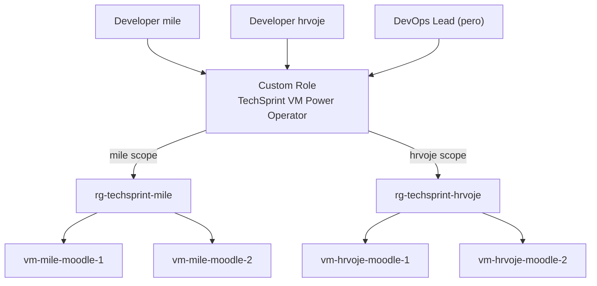

# Access Control Model for Azure (RBAC)

## Principle

Least privilege: developers control only the power state of their own VMs; the DevOps Lead controls all developer VMs.

## Custom role: TechSprint VM Power Operator

Created by Terraform with only: read VM / read VM instance state / start / restart / power off / deallocate. Developers are never assigned the broader `Virtual Machine Contributor` role.

Each developer gets this role scoped to only their own Resource Group (`mile -> rg-techsprint-mile`, `hrvoje -> rg-techsprint-hrvoje`), so a developer cannot control another developer's VMs. The DevOps Lead gets the same role across **all** developer Resource Groups, plus the central SSH entry point via the Jump Host.

## Automatic principal resolution

Assigning this role needs each user's Entra object ID. Rather than looking that up and pasting it in by hand after every CSV change, `azure/full/iam.tf` resolves it automatically: when `var.entra_domain` is set, it looks up `azuread_user` by `userPrincipalName = "<username>@<entra_domain>"` for every CSV entry (assumes that user already exists in Entra ID under that UPN). If `entra_domain` is left empty, or a user can't be resolved, the explicit `developer_principal_ids` / `lead_principal_id` variables are used as a manual fallback.

## VM Managed Identities

Every Moodle VM has a System Assigned Managed Identity with `Storage Blob Data Contributor` and `Storage File Data SMB MI Admin`, scoped only to that developer's own Storage Account.
